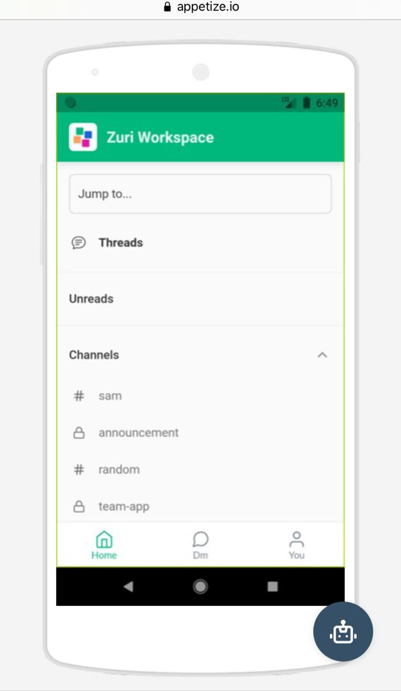
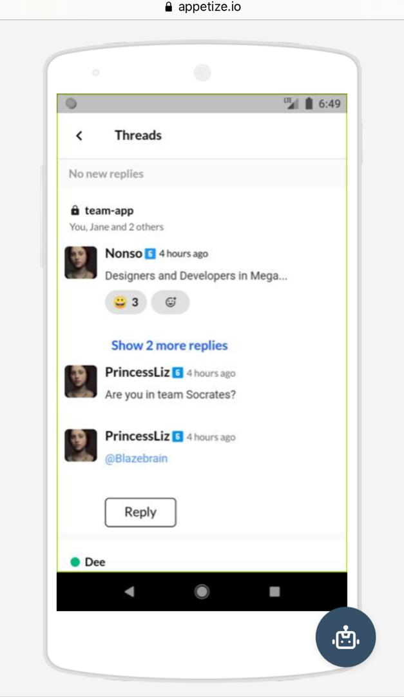

# Create-Workspace Workflow
This workflow enables a user of the zurichat app to create a message thread on the app


## **Endpoints consumed**

### **Create Thread**
URL:
```
POST: https://channels.zuri.chat/api/v1/{org_id}/messages/{channelmessage_id}/threads/
```

Payload:
```

{
  "user_id": "string",
  "content": "string",
  "files": [
    "http://example.com"
  ]
}
```


### **GET Thread Messages**
URL:
```
GET: https://channels.zuri.chat/api/v1/{org_id}/messages/{channelmessage_id}/threads/
```

Payload:
```
[
  {
    "_id": "string",
    "user_id": "string",
    "channelmessage_id": "string",
    "channel_id": "string",
    "content": "string",
    "files": [
      "http://example.com"
    ],
    "has_files": true,
    "emojis": [
      "string"
    ],
    "edited": true,
    "timestamp": "2019-08-24T14:15:22Z"
  }
]
```


### **PUT Thread Messages**
URL:
```
PUT: https://channels.zuri.chat/api/v1/{org_id}/threads/{thread_id}/
```

Payload:
```
{
  "content": "string"
}

```


DELETE v1_threads_delete


### **DEL Thread Messages**
URL:
```
https://channels.zuri.chat/api/v1/{org_id}/threads/{thread_id}/
```


## How to create a thread 
- Sign in into the zuri chat app
- click on sign in to your workspace
- Navigate to the thread section and click on it 
- View your messages and click on the one you want    to reply to 
- Add your message and send 

## Tutorial on how to create thread
  
  


