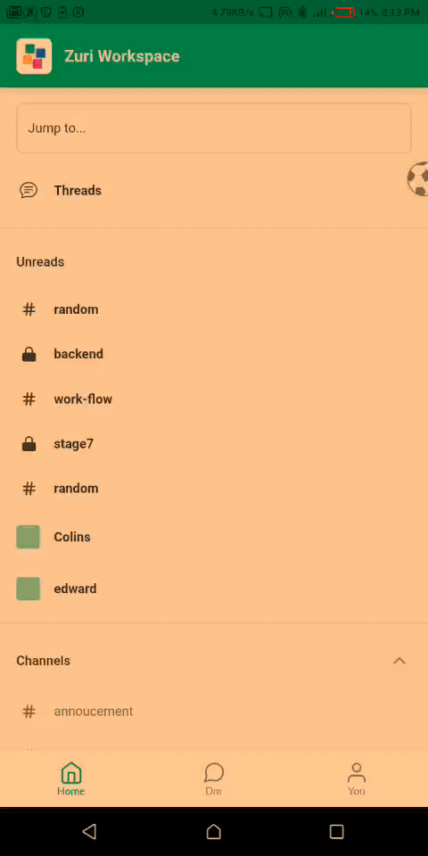

# Create-Workspace Workflow
This workflow enables a user of the zurichat app to create a workspace on the app

**Name of Endpoint Consumed**
```
Get an organization by its URL
```

**URL of endpoint consumed**
```
https://zuri.chat/documentation/organisation#tag/Organization
```


## How to create a Workspace 
- Navigate to the Home screen and Click the Zuri Icon.
- click on add workspace
- Click on sign in to workspace
- Input the workspace link
- Click next

## Tutorial on how to create workspace
  
