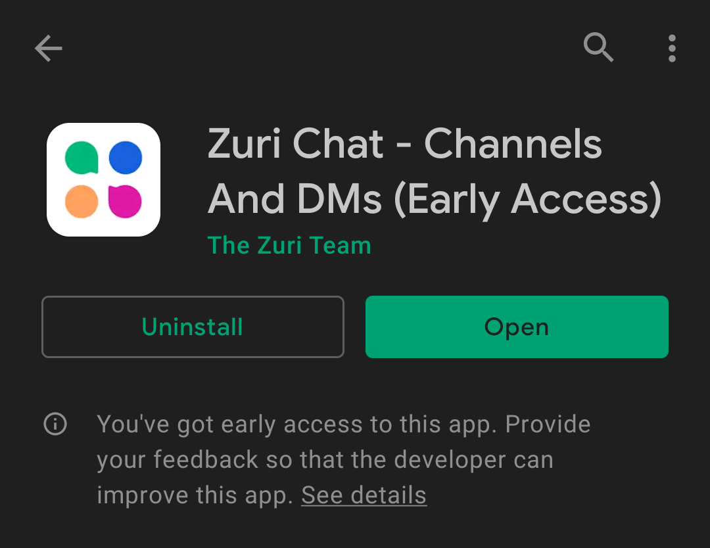

# How to Install Zurichat Mobile On Android Devices

<!-- ## step 1: Download zurichat on your device -->
Downloading zurichat mobile requires you to have [Google Play Services](https://play.google.com/store/apps/details?id=com.google.android.gms&hl=en&gl=US) on your android device.

## STEPS

1. Open Play Store on your android device often times located at the menu section.

.
2. Tap on the search section located at the top of the screen on Google play store and type "zuri chat" then tap search.

3. When the search completes then select the one stated on the screen that fits zuri chat mobile.

4. Tap on the install button.

5. Once the installation completes you've successfully installed zurichat mobile on your android device.
   

You can then proceed to either [sign up]() or [register]().
