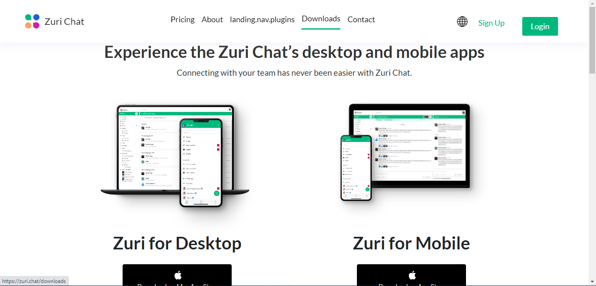
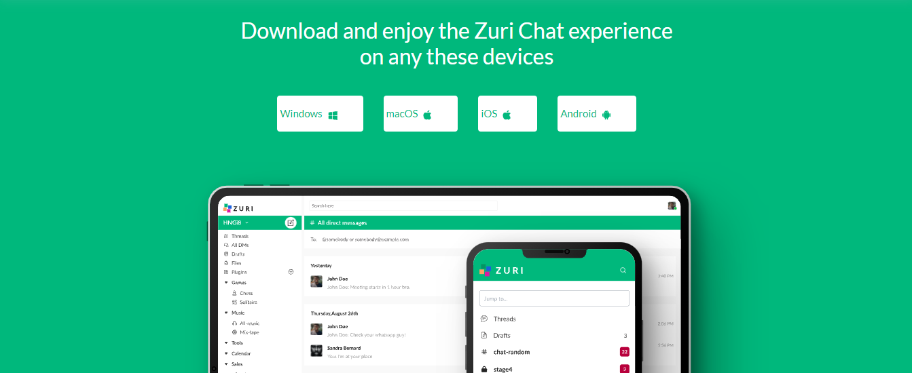

# How to install ZuriChat application  : your quick start guide 
Welcome to ZuriChat - ZuriChat  is a collaboration hub that brings the right people and tools together to get work done. You can use Zuri chat on web and mobile devices. To get you started on using zuri chat app on your mobile devices, read on the following steps **;**

## Click on the download section in the menu bar
#### When you have clicked on the download section on menu bar , you will then be directed to the download page

  
#

## Download the mobile app
#### On the download page, look for the ZuriChat mobile application that is compatible to your operating system,be it Android or IOS and click on it, you will then be directed to either the Play Store (Android) or App Store (IOS)

 
#