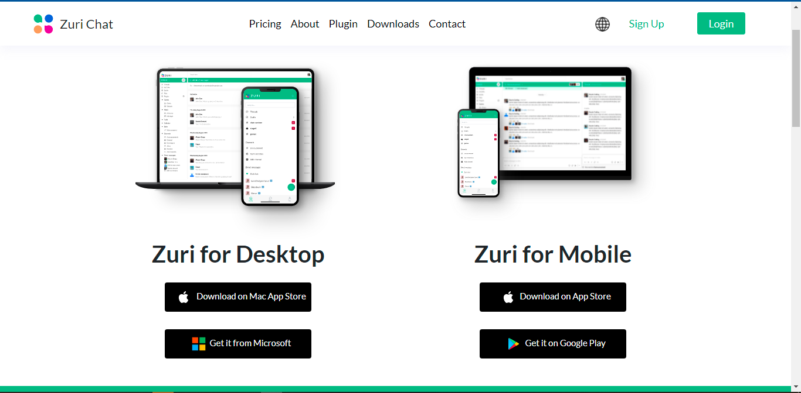
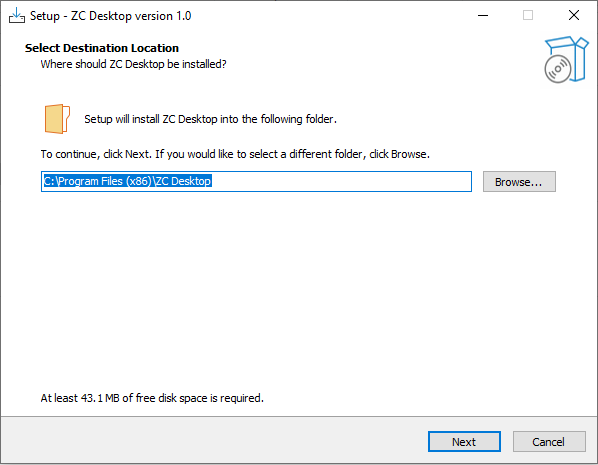
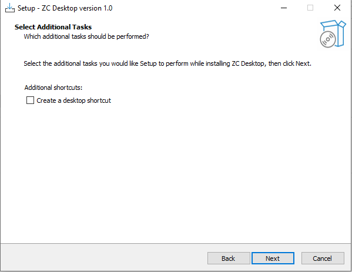
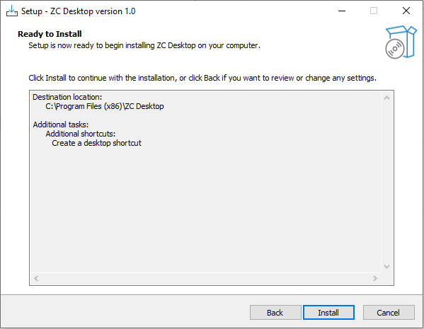
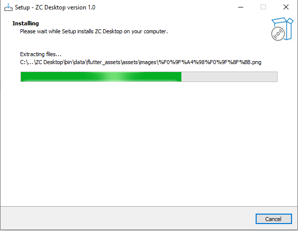
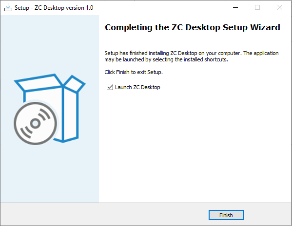

# ZURI CHAT DESKTOP CLIENT INSTALLATION GUIDE

```This guide will walk you through the download and installation process for the Zuri Chat Desktop Client.```

# DOWNLOADING ZURI CHAT DESKTOP CLIENT

- go to the url [Zuri Chat Download](https://zuri.chat/downloads)
- Navigate to the Zuri Chat Desktop
- Click on any of the download button to download for your operating system.
  
  

# INSTALLATION GUIDE

```Follow the instructions below for successful installation:```

- Start the installation process by opening the downloaded file.
- Specify the path to install the application.
  
  

- Click **Next** to proceed.
- Check the button if needed to Create a Desktop Icon shortcut.
  
  

- Click **Next** to proceed.
  
  

- Click **Install** to begin the installation process.
  
  

- Wait for the installation process to be completed.
  
  

- Click **Finish** to launch the application.
